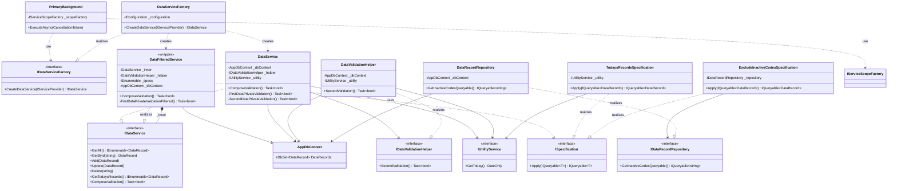

```mermaid
classDiagram
    class PrimaryBackground {
        -IServiceScopeFactory _scopeFactory
        +ExecuteAsync(CancellationToken)
    }

    class IDataServiceFactory {
        <<interface>>
        +CreateDataService(IServiceProvider) IDataService
    }

    class IDataService {
        <<interface>>
        +GetAll() IEnumerable~DataRecord~
        +GetById(string) DataRecord
        +Add(DataRecord)
        +Update(DataRecord)
        +Delete(string)
        +GetTodaysRecords() IEnumerable~DataRecord~
        +ComposeValidation() Task~bool~
    }

    class DataService {
        -AppDbContext _dbContext
        -IDataValidationHelper _helper
        -IUtilityService _utility
        +ComposeValidation() Task~bool~
        -FirstDataPrivateValidation() Task~bool~
        -SecondDataPrivateValidation() Task~bool~
    }

    class DataFilteredService {
        <<wrapper>>
        -IDataService _inner
        -IDataValidationHelper _helper
        -IEnumerable _specs
        -AppDbContext _dbContext
        +ComposeValidation() Task~bool~
        -FirstDataPrivateValidationFiltered() Task~bool~
    }

    class IDataValidationHelper {
        <<interface>>
        +SecondValidation() Task~bool~
    }

    class DataValidationHelper {
        -AppDbContext _dbContext
        -IUtilityService _utility
        +SecondValidation() Task~bool~
    }

    class IUtilityService {
        <<interface>>
        +GetToday() DateOnly
    }

    class ISpecification {
        <<interface>>
        +Apply(IQueryable~T~) IQueryable~T~
    }

    class TodaysRecordsSpecification {
        -IUtilityService _utility
        +Apply(IQueryable~DataRecord~) IQueryable~DataRecord~
    }

    class ExcludeInactiveCodesSpecification {
        -IDataRecordRepository _repository
        +Apply(IQueryable~DataRecord~) IQueryable~DataRecord~
    }

    class IDataRecordRepository {
        <<interface>>
        +GetInactiveCodesQueryable() IQueryable~string~
    }

    class DataRecordRepository {
        -AppDbContext _dbContext
        +GetInactiveCodesQueryable() IQueryable~string~
    }

    class AppDbContext {
        +DbSet~DataRecord~ DataRecords
    }

    class DataServiceFactory {
        -IConfiguration _configuration
        +CreateDataService(IServiceProvider) IDataService
    }

    %% BackgroundService
    PrimaryBackground ..> IDataServiceFactory : use
    PrimaryBackground ..> IServiceScopeFactory : use

    %% Factory
    DataServiceFactory ..|> IDataServiceFactory : realizes
    DataServiceFactory ..> DataService : creates
    DataServiceFactory ..> DataFilteredService : creates

    %% IDataService implementations
    DataService ..|> IDataService : realizes
    DataFilteredService ..|> IDataService : realizes

    %% Wrapper composition
    DataFilteredService *-- IDataService : _inner
    DataFilteredService ..> ISpecification : uses
    DataFilteredService --> AppDbContext

    %% DataService dependencies
    DataService --> AppDbContext
    DataService --> IDataValidationHelper
    DataService --> IUtilityService

    %% ValidationHelper
    DataValidationHelper ..|> IDataValidationHelper : realizes
    DataValidationHelper --> AppDbContext
    DataValidationHelper --> IUtilityService

    %% Specifications
    TodaysRecordsSpecification ..|> ISpecification : realizes
    ExcludeInactiveCodesSpecification ..|> ISpecification : realizes
    TodaysRecordsSpecification --> IUtilityService
    ExcludeInactiveCodesSpecification --> IDataRecordRepository

    %% Repository
    DataRecordRepository ..|> IDataRecordRepository : realizes
    DataRecordRepository --> AppDbContext
```
